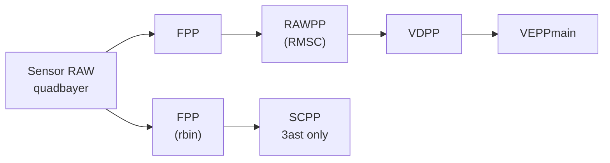

# 4K30 Flow Table Editor

用于编辑 4K30 Normal Preview 流程图、配置表及关联配置文件的本地 Web 工具。主页面位于 `table-editor/`，通过 Python 标准库提供本地服务，页面不依赖 Node.js 构建步骤或第三方 Python 包。

## 功能概览

- 在一张画布中查看和编辑流程图、Usecase 定义、3AST、分辨率变化、F2M、Sensor、main/sub GDC0 和 GDC1 配置。
- 直接编辑表格文字、分辨率宽高和流程模块名称；配置型单元格通过选项菜单选择。
- 根据输入分辨率自动更新关联分辨率、scale ratio、GDC1 mesh 网格等派生值。
- 根据页面标题中的 `path/scale` 模式灰显未启用分支，并把相应连接线显示为灰色虚线。
- 编辑或导入 IMC 覆盖文件、Usecase 脚本和外部 SVG 流程图；支持移动、调整这些辅助模块的大小。
- 调用本地 Python F2M 脚本，将 D1/D2/D4 ROI 回填到 F2M 表格。
- 导出包含画布内所有表格、辅助模块和当前标题的高分辨率 PNG 图片。

## 快速开始

### 前置条件

- Windows
- Python 3，且 `python` 已加入 `PATH`
- Chrome、Edge 等现代浏览器

在仓库根目录双击 [start-table-editor.cmd](start-table-editor.cmd)。脚本会先结束旧的 Table Editor 服务进程，确认 `4173` 端口可用后重新启动服务，并打开：

```text
http://127.0.0.1:4173/table-editor/
```

也可以手动启动：

```powershell
python server.py --host 127.0.0.1 --port 4173
```

页面必须经本地服务打开。直接双击 `table-editor/index.html` 会进入提示页，因为 SVG、外部文件模块和 F2M API 都需要 HTTP 服务。

## 主要操作

### 画布与页面标题

- 鼠标滚轮缩放画布；在空白区域按住左键拖动画布。
- 顶部工具栏提供复位、缩小、放大、适配窗口、全屏及导出图片。
- 单击标题可直接修改；输入完成后按 `Enter` 会标准化标题中的 path/scale 写法。
- 表格单元格会自动保存到浏览器本地存储；刷新页面后会恢复。
- `Tab` 和 `Shift+Tab` 可在可编辑表格单元格间前后切换。

“复位”会恢复本次页面加载完成时的标题、表格值、流程模块文字/横线和各模块布局，不会改写外部 TXT、SH 或 SVG 文件。

### 标题中的 Path/Scale 规则

推荐标题格式：

```text
4K30 16:9 Normal 1path2scale 2path3scale preview
```

每条 path 独立控制层级：

| 标记 | 启用分支 |
| --- | --- |
| `1path1scale` | Path 1 的 D1 |
| `1path2scale` | Path 1 的 D1、D4 |
| `1path3scale` | Path 1 的 D1、D4、D16 |
| `2path1scale` | Path 2 的 D1 |
| `2path2scale` | Path 2 的 D1、D4 |
| `2path3scale` | Path 2 的 D1、D4、D16 |

省略某条 path 时，该 path 按未启用处理。未启用模块会灰显，关联连接线变为灰色虚线。流程图中的黑色圆点表示分叉交叉点；虚线从对应分叉点之后开始，分叉点之前的共用线路保持实线。

旧标题中的 `Multi-scale` 或 `Mutil-scale` 会迁移为 `3scale`，旧的仅 `2path...` 标题会补齐同级的 `1path...` 标记。

### `Normal` 示例公共链路


### `Ainr` 示例公共链路


### `rmsc_off` 示例公共链路

当标题包含 `rmsc_off` 时，公共链路采用以下 RMSC 结构；后续 VEPP 分支仍由标题中的 path/scale 规则控制。



### 流程图模块

流程图内的模块名称可直接点击编辑，修改后自动保存在浏览器本地存储。选中一个模块后，顶部 `S` 按钮可切换该模块文字的删除线；删除线和编辑后的名称都会体现在导出的图片中。

灰显由标题 path/scale 自动控制，不能通过删除线按钮解除。当前流程图使用四个黑色分叉标记，分别对应两条主干的首个分叉与 D4/D16 的 T 型分叉。

### 表格编辑与自动计算

普通单元格支持直接编辑，多行输入会保留换行。工作模式、链路模式、EIS、对齐类型、VEPP1 和 VEPP2 等配置项使用弹出选项菜单，避免自由输入导致无效配置。

分辨率变化表中的 `w`、`h` 以独立数字输入框呈现。以下值是主要输入源：

- `main-D1 Sensor`：更新 FPP（向下取整到 32 对齐）、main D4/D16 的 V1-ysc，以及 sub V1-ysc。
- `main-D1 V2-wr`：更新 main-D1 V1-gdc0（向上取整到 32 对齐）。
- 页面标题中的宽高比，例如 `16:9`：用于计算 sub V1-gdc0 的宽度，固定高度为 1088。
- sub V1-ysc 与 sub V1-gdc0：更新 sub GDC0 D1 的 `scale_ratio`。

工具会继续推导 main D4/D16 的 V1-ysc、V1-gdc0、V2-ysc，main GDC0 的 D1/D4/D16 `scale_ratio`，以及 main GDC1 的 `mesh_nx/mesh_ny`。派生字段由工具管理，建议修改其上游输入而不是直接覆盖结果。

### F2M 计算

点击画布中的“触发 iq-f2m 配置计算”按钮，会读取 `main-D1 V1-gdc0` 的宽高，调用本地 Python 脚本，并把返回的 `d1`、`d2`、`d4` ROI 回填到 F2M 表格。运行日志会显示在对话框中，便于检查命令、标准输出和错误信息。

计算按钮左侧的导入图标可上传 `.py` 脚本。服务会校验文件扩展名和 Python 语法，通过后以该文件名保存到项目根目录，并立即切换为当前计算脚本；后续计算会直接运行新上传的文件。导入结果和实际执行路径会显示在完整计算日志中。

服务默认使用：

```text
项目根目录\calc_mctf_f2m_roi_n_modified.py
```

脚本随项目保存，无需配置外部绝对路径。脚本需支持以下参数：

```text
--width <整数> --height <整数> --out <输出文件>
```

输出文件必须包含 `d1`、`d2`、`d4` 三行四元素数组，例如：

```text
d1: [0.0, 0.0, 1.0, 1.0]
```

### 外部文件模块

画布右侧提供三个独立模块：

| 模块 | 默认文件 | 可执行操作 |
| --- | --- | --- |
| IMC 覆盖配置 | `imcoverridesettings(1).txt` | 编辑、导入 TXT、保存、刷新、改名、拖动、调整大小 |
| Usecase 脚本 | `3840x2176_30_ainr_yuvflow_eis_on_c10_sensormode42.sh` | 编辑、导入 SH、保存、刷新、改名、拖动、调整大小 |
| 外部流程图 | `imcmctfnnnoainrpipeline.svg` | 导入 SVG、改名保存、刷新、拖动、调整大小、双击全屏查看 |

代码模块编辑后显示“未保存”。点击保存按钮或在代码框内按 `Ctrl+S` / `Cmd+S` 才会将内容写回磁盘。导入操作会直接写入目标文件；改名会重命名目标文件。因此使用前请确认服务所配置的路径指向允许修改的工作副本。

外部流程图在全屏查看时支持滚轮缩放和拖动平移；再次双击可恢复为 1:1 视图。

### 移动与调整模块

表格、F2M 计算按钮、代码模块和外部流程图模块都可以拖动。表格及文件模块右下角的控制点用于调整大小。位置和尺寸会保存在浏览器本地存储，并纳入 PNG 导出范围。

## PNG 导出

点击“导出图片”会以当前页面标题生成 PNG 文件，并写入项目根目录的 `output/`。标题中的 Windows 非法字符会自动替换为下划线；同名标题再次导出时会覆盖同名文件。导出内容包括：

- 页面标题和“4K30 配置总览”页眉。
- 流程图、所有表格、当前 path/scale 灰显状态、黑色分叉点和流程模块删除线。
- F2M 计算按钮、两个代码模块和外部 SVG 模块，使用当前的位置及尺寸。
- 表格中的原始换行；本身没有换行的内容保持单行。
- 灰显单元格和灰显流程分支的灰色样式。

导出以 2 倍画布比例渲染。GDC0 scale ratio 与特定 F2M ROI 会按既定可读性规则自动换行；这些规则只影响导出布局，不会改写页面中的原始编辑值。

## 日志

服务访问、文件导入和图片导出事件会追加到 `log/table-editor.log`。每次 F2M 计算都会将完整命令、标准输出、标准错误和脚本输出另存为 `log/f2m-时间戳.log`。启动服务的标准输出和错误输出分别写入 `log/server.stdout.log` 与 `log/server.stderr.log`。

## 外部文件路径

F2M Python 脚本和 PDF 保存在项目根目录，TXT、SH 与 SVG 文件保存在项目内的 `A300_Usecase/` 目录；所有运行文件都不依赖项目外部的绝对目录。可访问以下地址检查当前服务实际使用的路径：

```text
http://127.0.0.1:4173/api/health
```

## 本地存储与磁盘写入

浏览器本地存储保存表格值、标题、流程模块名称/删除线以及各模块布局。本版本首次打开时会进行一次默认状态升级，将旧的浏览器状态替换为项目内置基准；升级完成后，用户后续修改仍会正常保存。“复位”会随时恢复到这套项目默认状态。

外部 TXT、SH 和 SVG 文件不会因普通页面编辑自动写入。只有点击对应保存按钮、使用快捷键保存、导入文件或保存文件名时，服务才会对配置路径中的文件执行写入或重命名。

## HTTP API

所有接口仅应通过本机 `127.0.0.1` 使用。

| 方法 | 路径 | 用途 |
| --- | --- | --- |
| `GET` | `/api/health` | 检查服务及当前外部文件路径 |
| `GET` / `PUT` | `/api/imc-overrides` | 读取或保存 IMC 配置文本及文件名 |
| `POST` | `/api/imc-overrides/import` | 导入 IMC 文本文件 |
| `GET` / `PUT` | `/api/usecase-script` | 读取或保存 Usecase 脚本文本及文件名 |
| `POST` | `/api/usecase-script/import` | 导入 Usecase 脚本 |
| `GET` / `PUT` | `/api/pipeline-diagram-info` | 查询或保存外部流程图文件名 |
| `GET` / `PUT` | `/api/pipeline-diagram.svg` | 读取或导入外部 SVG 流程图 |
| `POST` | `/api/calc-f2m` | 运行 F2M 脚本并返回 ROI 与日志 |
| `POST` | `/api/export-image` | 将页面导出的 PNG 写入 `output/` |

服务会限制请求体大小、校验文件名不可包含路径分隔符或 Windows 非法字符，并在导入 SVG 时检查根元素是否为 `svg`。

## 项目结构

```text
.
├─ assets/
│  └─ 4k30-normal-preview.svg       # 主流程图和表格 SVG 源数据
├─ table-editor/
│  ├─ index.html                    # 编辑器页面结构
│  ├─ app.js                        # 编辑、联动、导出与模块布局逻辑
│  └─ styles.css                    # 编辑器页面样式
├─ A300_Usecase/
│  ├─ imcoverridesettings(1).txt    # 默认 IMC 覆盖配置
│  ├─ 3840x2176_30_ainr_yuvflow_eis_on_c10_sensormode42.sh
│  │                                # 默认 Usecase 脚本
│  ├─ imcmctfnnnoainrpipeline.svg   # 默认外部流程图
│  ├─ imcmctfainrnnflowmappipeline2.svg
│  │                                # 备用流程图
│  ├─ 4k30_normal_example.svg       # 原始示例 SVG
│  └─ 4k30_normal_example.drawio.svg
│                                   # Draw.io 示例 SVG
├─ calc_mctf_f2m_roi_n_modified.py  # F2M ROI 计算脚本
├─ 2_Usecase.pdf                     # Usecase 参考文档
├─ output/                            # 按标题保存的 PNG 导出文件
├─ log/                               # 服务与 F2M 计算日志
├─ server.py                        # 本地 HTTP API 与 F2M 脚本调用
├─ start-table-editor.cmd           # Windows 快速启动脚本
└─ README.md
```

## 常见问题

### 页面提示需要通过本地服务打开

请运行 `start-table-editor.cmd`，或使用 `python server.py --host 127.0.0.1 --port 4173` 后访问 `/table-editor/`。不要直接打开 HTML 文件。

### 代码模块或流程图显示“找不到文件”

检查 `/api/health` 返回的路径，确认文件存在且当前用户有读取权限。可通过环境变量改为本机实际路径后重启服务。

### F2M 计算失败

确认 `main-D1 V1-gdc0` 的宽高均为正整数，`F2M_SCRIPT` 路径存在，且脚本可由当前 Python 解释器运行。详细错误会显示在 F2M 日志对话框中。

### 导出图片缺少辅助模块

导出范围会根据当前辅助模块的位置和尺寸计算。确认模块没有被移到极端坐标，且外部流程图已加载完成后再导出。

### 本地保存的状态不符合预期

点击“复位”恢复表格、流程模块和布局默认值；如仍需完全清空，可在浏览器中清除 `127.0.0.1:4173` 的站点数据。

## 开发说明

页面通过 `fetch('../assets/4k30-normal-preview.svg')` 读取主 SVG。表格输入依赖 SVG 中的 `foreignObject`，而 PNG 导出会同步更新 SVG fallback 文本后移除 `foreignObject`，以确保图片中保留可编辑状态、换行和灰显样式。

修改主 SVG 的表格结构或流程图坐标后，应同步检查 `table-editor/app.js` 中的单元格坐标映射、分辨率联动规则和 path/scale 连接线规则。
